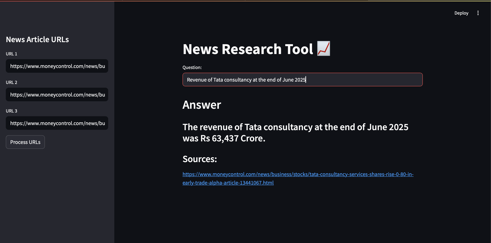

# Gen-AI-Project--Equity-News-Research-Tool

A Generative AI-powered application for effortless financial news analysis.  
This tool fetches equity/stock market-related articles from URLs, processes them with **LangChain**, generates embeddings using **OpenAI**, and enables quick, relevant information retrieval using **FAISS**.  
Users can input queries and receive precise, context-rich answers along with source URLs.
## 📸 Screenshot

---

## 🚀 Features

- **URL & File Input**  
  Load article URLs directly.

- **Automated Content Extraction**  
  Extract and clean article content using LangChain’s `UnstructuredURLLoader`.

- **Semantic Search with Embeddings**  
  Generate embeddings via **OpenAI** and store them in **FAISS** for efficient similarity search.

- **LLM-powered Q&A**  
  Ask domain-specific queries and get concise answers backed by source references.

---

## 🛠️ Tech Stack

- **LangChain** – Content loading & processing  
- **OpenAI Embeddings** – Text vectorization  
- **FAISS** – Vector database for similarity search  
- **ChatGPT / LLM** – Natural language question answering  

---

## 📂 How It Works

1. **Load URLs** – Input one or more article links or upload a file with URLs.  
2. **Process Articles** – Extract content using LangChain’s loaders.  
3. **Create Embeddings** – Convert text into vectors using OpenAI.  
4. **Store & Search** – Save vectors in FAISS for similarity search.  
5. **Query the LLM** – Ask questions and get relevant answers with source URLs.

---
## Project Structure
- **main.py**: The main Streamlit application script.
- **requirements.txt**: A list of required python packages for the project.
- **index.faiss**: Binary FAISS index storing embeddings.
- **index.pkl**: Pickle file storing metadata for each embedding.
- **.env**: Configuration file for storing your OpenAI API key.
